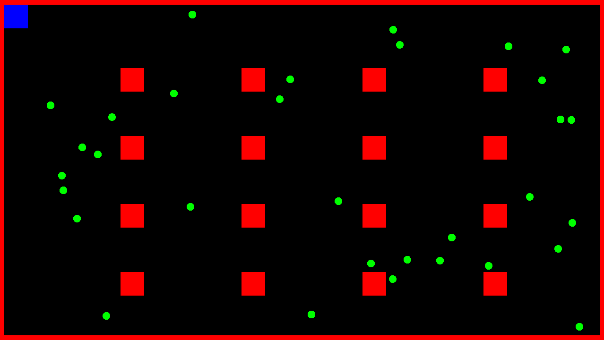

# Object Collisions

- Simple simulation of object collisions with visualization using SFML graphics.

## Running
- Linux:
  ```shell
  git clone https://github.com/mnink275/SFML-KRPG
  cd SFML-KRPG/
  git submodule update --init
  make run
  ```


